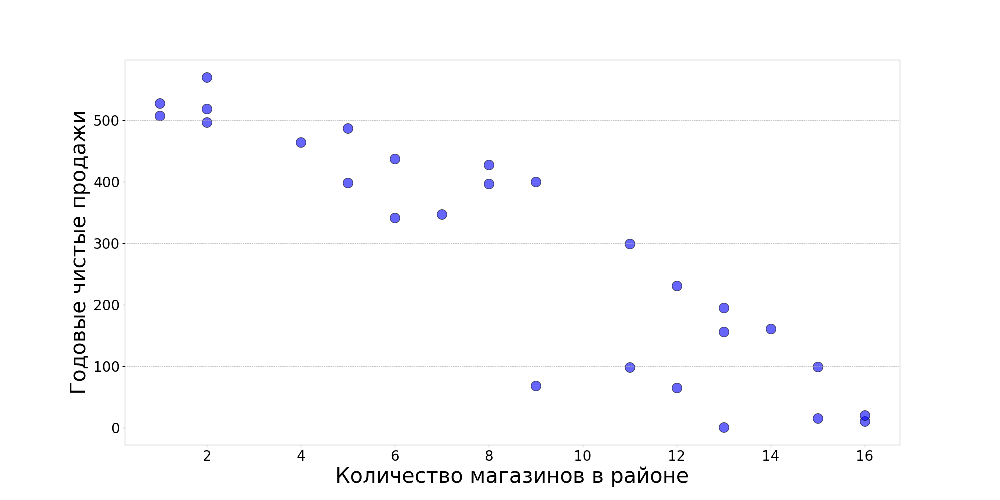
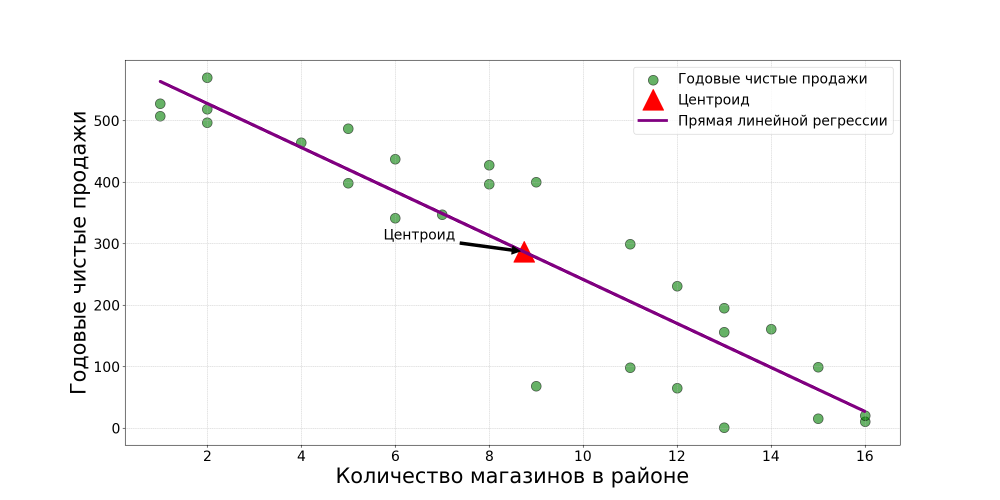

# Анализ продаж в зависимости от количества магазинов

## Описание
Этот проект предназначен для анализа взаимосвязи между годовыми чистыми продажами и количеством магазинов в районе. Программа загружает данные из CSV-файла, проводит их предварительную обработку, анализирует и визуализирует результаты анализа. Целью проекта является предоставление статистического анализа продаж, включая вычисление линейной регрессии и визуализацию взаимосвязи между количеством магазинов и продажами.

## Функционал
- Загрузка и предварительная обработка данных из CSV-файла.
- Переименование столбцов для удобства анализа.
- Удаление нерелевантных столбцов данных.
- Визуализация данных для анализа взаимосвязи между продажами и количеством магазинов.
- Расчет параметров линейной регрессии для предсказания продаж.

## Зависимости
Для работы программы необходимы следующие библиотеки:
- `numpy`
- `pandas`
- `matplotlib`

## Установка и запуск проекта
1. Клонируйте репозиторий:
```
git clone https://github.com/Sogato/BDA-lab7.git
```
2. Создайте виртуальное окружение:
```
python -m venv env
```
3. Установите зависимости проекта:
```
pip install -r requirements.txt
```
4. Запустите программу:
```
python main.py
```

## Пример использования
После запуска программы вы увидите в консоли параметры линейной регрессии, а также в директории проекта будут сохранены следующие файлы:
- `initial_data_plot.png` — изображение, показывающее исходное распределение данных.
- `regression_line_plot.png` — изображение с линейной регрессией, показывающее взаимосвязь между количеством магазинов и продажами.

## Визуализация результатов

### Исходное распределение данных


Этот график показывает начальное распределение данных о продажах и количестве магазинов.

### Линейная регрессия


На этом графике представлена линейная регрессия, иллюстрирующая взаимосвязь между количеством магазинов в районе и годовыми чистыми продажами.

---

Подготовлено в рамках учебного проекта. Все данные взяты из открытых источников и использованы исключительно в образовательных целях.

---

## Контрольные вопросы

### 1. Судя по данным коэффициента корреляции, какой тип корреляции наблюдается между годовой выручкой от продаж и количеством магазинов в районе?
Основываясь на отрицательном угловом коэффициенте линии регрессии (-35.79), наблюдается обратная (или отрицательная) корреляция между годовой выручкой от продаж и количеством магазинов в районе. Это означает, что с увеличением количества магазинов в районе годовая выручка от продаж, как правило, снижается.


### 2. Линейную регрессию в Python можно выполнить другими способами, назовите несколько?
Угловой коэффициент линии регрессии является отрицательным (-35.79), что указывает на обратную (отрицательную) корреляцию между годовыми чистыми продажами и количеством магазинов в районе. Это означает, что с увеличением количества магазинов в районе годовые чистые продажи, как правило, уменьшаются.

**Альтернативные способы выполнения линейной регрессии в Python:**
- Использование библиотеки `statsmodels`, например, функции `OLS` для построения модели ординарной линейной регрессии.
- Использование библиотеки `scikit-learn`, например, класса `LinearRegression` для построения предиктивных моделей.
- Применение метода `LinearRegression` из библиотеки `seaborn`, который также строит регрессионные линии на графиках.

### 3. Как вы думаете, является ли линейная регрессия методом машинного обучения?
Линейная регрессия считается одним из методов машинного обучения, конкретно — это метод обучения с учителем. Он используется для прогнозирования количественных значений, опираясь на взаимосвязь между зависимыми и независимыми переменными. В контексте машинного обучения, модель линейной регрессии обучается на данных с известными ответами, чтобы научиться предсказывать результаты для новых, невиданных данных.
